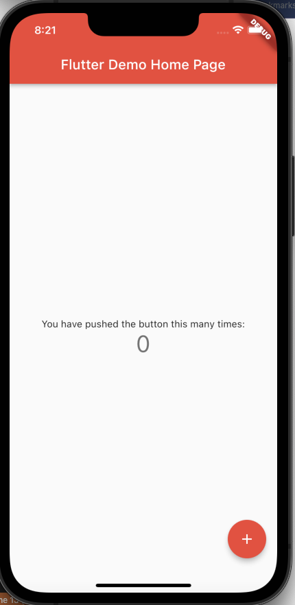
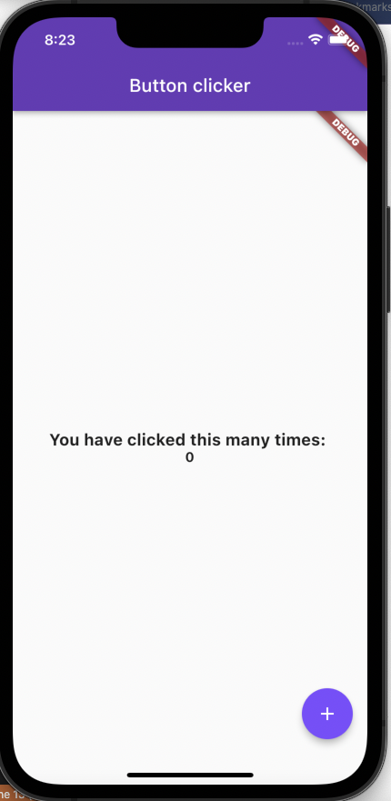

# Button Click Introduction App

Modified version of the Flutter button click program. The floating action button is clicked and the number of the times clicked is displayed on the center. This program uses Stateless and Stateful widgets.

## Flutter's introduction App

## My custom take on Flutter's introduction App
